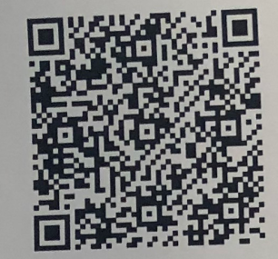
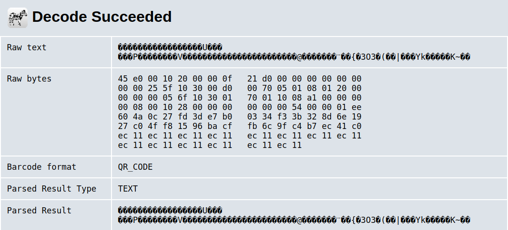
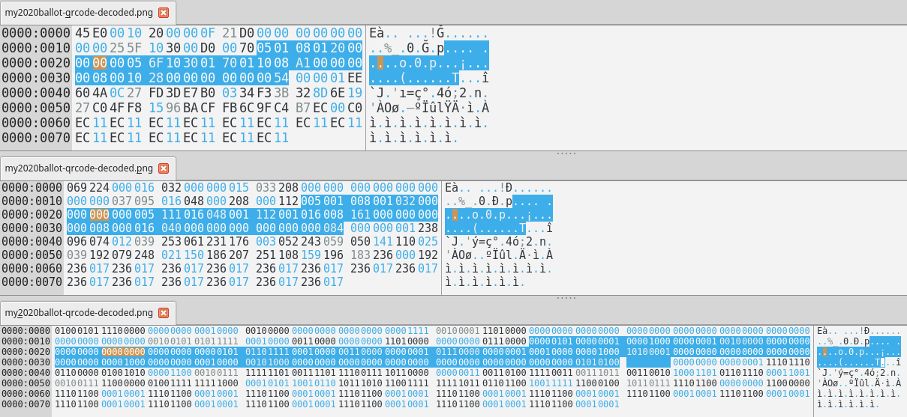
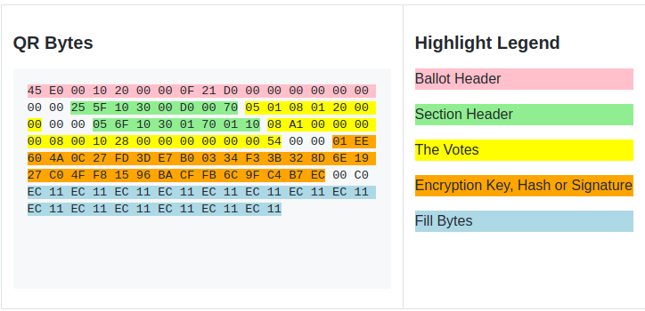

# Decoding the Dominion ImageCast X Ballot QR Code

## Overview
The [*Dominion ImageCast X* Ballot Marking Device](https://verifiedvoting.org/election-system/dominion-imagecast-x/) ( or *BMD*) was used at my voting precinct in Chicago, IL for the 2020 General Elections.  Described in this document is the process I used to reverse engineer the QR Code
to see that my ballot QR Code did in fact contain my intended votes.

## Discovery Process
### 1. Ballot Snapshot
A week before November 3rd, 2020 during early voting in Chicago, I took a snapshot of my ballot immediately upon printing it before I turned it over to the election staff for processing into the ballot scanner/tabulator.  
<table>
    <tr>
        <td>
        Below is the photograph of my ballot:
        <br>
        </td>
        <td valign=top>
        I isolated the QR Code portion:
        <br>
        </td>
    </tr>
    <tr>
        <td colspan="2">
        I submitted the QR Code image to [zxing.org](https://zxing.org) to decode its binary contents:
        <br>
        </td>
    </tr>
</table>

### 2. Download the sample ballot from the Chicago Board of Elections
I used the [Chicago Elections web site](https://chicagoelections.gov/en/sample-ballot.asp?ballot-style=306&wrd=46&pct=20&con=9&leg=7&rep=13&jud=8&ccd=10&bor=2) to locate my ballot options in the 2020 General Election.  Using a developer console I then added html input boxes to the page so I could re-mark the vote I casted the day I voted.  Example code snippet:
```
var c =document.getElementsByClassName('candidates');
var pos = 1;
for(i=0;i<c.length;i++){
    if((c[i].innerText.indexOf('Yes')>-1 || c[i].innerHTML.indexOf('nbsp')>-1) && c[i].innerHTML.indexOf('"candidates"')==-1 ) {
        var el = document.createElement('div');
        el.innerHTML = 'Position: ' + (pos++) + '<input name=pos'+pos+' value=0>'; 
        c[i].append(el);
        if(c[i].innerText.indexOf('No')>-1) {
            el = document.createElement('div');
            el.innerHTML = 'Position: ' + (pos++) + '<input name=pos'+pos+' value=0>'; 
            c[i].append(el);
        }
    }
}
```
### 3. Marked the sample ballot from the Chicago Board of Elections
I then marked each input with "1" for every candidate/question that I voted on election day. [Here is my ballot marked in HTML format](./assets/my2020ballot-html.html) 

After which I ran another snippet in the developer console to provide me a binary string representation on my ballot.
```
var inputs=document.getElementsByTagName('input');
var s = '';
for(i=0;i<inputs.length;i++){
    s += inputs[i].value;
}
console.log(s);
```
The output of the above snippet is the following 180 character string of 0's ans 1's:
```
010100000001000010000000000100100000000000000000001000101000010000000000000000000000000000000000001000000000000001000000101000000000000000000000000000000000000000000000000000010101
```
### 4. Examine the raw QR Code data
Using [*Okteta*](https://apps.kde.org/en/okteta) raw data editor I loaded the decoded QR Code to view the file in hex, decimal, and binary views:
<br>

### 5. Locating the vote bits from Step 3
I was able to locate the bits output from **Step 3** in two different blocks in the QR Code Raw Data.
<br><br>The first block of 50 votes is located at offset 1A (27th byte), left padded with 4 zero bits and right padded with 2 zero bits:
```
0000 01010000000100001000000000010010000000000000000000 00
becomes:
00000101 00000001 00001000 00000001 00100000 00000000 00000000
in hex:
05 01 08 01 20 00 00
```
<br>The second block of 130 votes is located at offset 2B (44th byte), left padded with 4 zero bits and right padded with 2 zero bits:
```
0000 1000101000010000000000000000000000000000000000001000000000000001000000101000000000000000000000000000000000000000000000000000010101 00
becomes:
00001000 10100001 00000000 00000000 00000000 00000000 00001000 00000000 00010000 00101000 00000000 00000000 00000000 00000000 00000000 00000000 01010100
in hex:
08 A1 00 00 00 00 08 00 10 28 00 00 00 00 00 00 54
```
### 6. My Ballot QR Code Analysis
Based on the above steps, I perceive the QR Code bytes to have the following approximate structure.
<br>
<!-- <table>
    <tr>
        <td>
            <h3>QR Bytes</h3>
<pre>
<span style="background-color: pink">45 E0 00 10 20 00 00 0F 21 D0 00 00 00 00 00 00 </span>
00 00 <span style="background-color: lightgreen">25 5F 10 30 00 D0 00 70</span> <span style="background-color: yellow">05 01 08 01 20 00 
00</span> 00 00 <span style="background-color: lightgreen">05 6F 10 30 01 70 01 10</span> <span style="background-color: yellow">08 A1 00 00 00 
00 08 00 10 28 00 00 00 00 00 00 54</span> 00 00 <span style="background-color: orange">01 EE 
60 4A 0C 27 FD 3D E7 B0 03 34 F3 3B 32 8D 6E 19 
27 C0 4F F8 15 96 BA CF FB 6C 9F C4 B7 EC</span> 00 C0 
<span style="background-color: lightblue">EC 11 EC 11 EC 11 EC 11 EC 11 EC 11 EC 11 EC 11 
EC 11 EC 11 EC 11 EC 11 EC 11 EC 11</span>
<pre>
        </td>
        <td valign=top>
            <h3>Highlight Legend</h3>
            <p style="background-color: pink">Ballot Header </p>
            <p style="background-color: lightgreen">Section Header</p>
            <p style="background-color: yellow">The Votes</p>
            <p style="background-color: orange">Encryption Key, Hash or Signature</p>
            <p style="background-color: lightblue">Fill Bytes</p>
        </td>
    </tr>
</table> -->

### 7. Conclusion

After the above analysis, I have a near 100% confidence that the votes hidden in my QR Code did indeed match my intended votes for this election.  However, this confidence is limited ONLY to my single vote and as it pertains to the QR Code only.  This study can not conclude that ALL QR Codes contain the correct intended votes for ALL voters using the *Dominion ImageCast X BMD* around the country, nor can it conclude that the scanner/tabulators correctly allocated the votes.
<br><br>
I am interested in writing an application that would do this verification online, but I would need more sample ballot QR Codes in order to standardize the verification process.
<br><br>
I am releasing this information to the public so that others can verify their QR Code Ballots.  If you have a picture of your ballot from a recent election and are not able to follow this process to verify your ballot, feel free to email me at verify-qr-ballot@idk.email.  